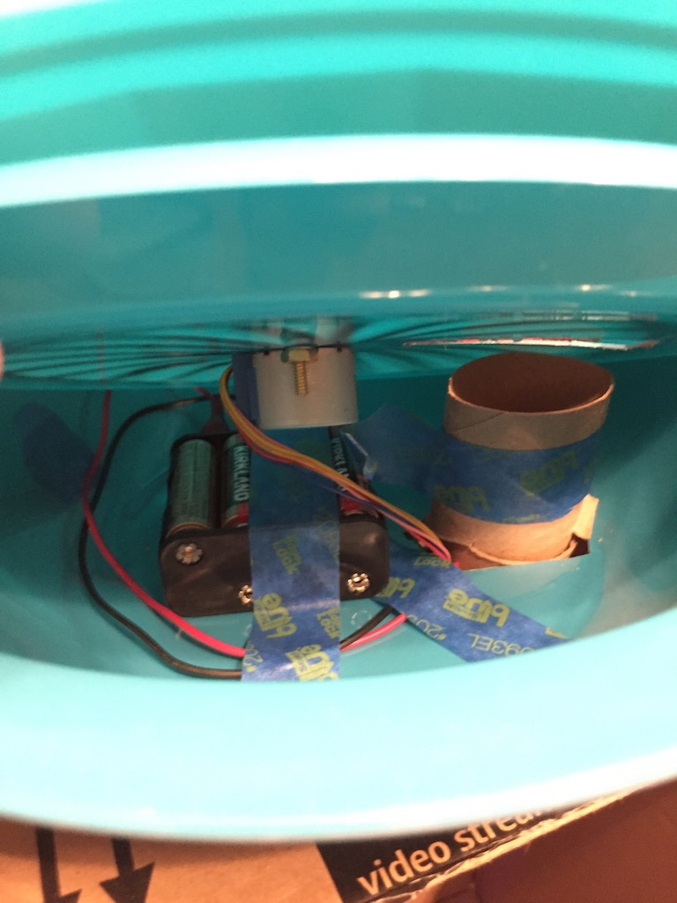

# Treat Dispenser
Helping my dog’s separation anxiety with a treat dispenser that's remotely controlled using an iOS app, Arduino, Firebase and a little bit of ingenuity.

## Background
My dog has separation anxiety. Watching remotely when he’s home alone, I could see that he gets anxious around the 4-hour mark. Though talking to him during this time helps, I needed something to keep him focused as a coping mechanism.

So I came up with Treat Dispenser. For my dog, it became a magical machine that came to life when he was alone that chimes and dispenses treats throughout the day.

  
  

## The Build and Platform

I built the dispenser using parts around the house and made it gravity based to minimize the parts needed to dispense the treat.

Hardware
* Arduino board w/ BLE to communicate
* Servo w/ batteries to turn feeder
* Old iPhone 4S to be the hardware UI and bridge between Arduino and Firebase.
* Cardboard box, paper towel tubes and cheap plastic bowl/plate.

Software
* Arduino sketch
* Firebase Realtime Database (Google)
* iOS app to control remotely
* Initially, macOS app w/ FirebaseCommunity pod as the controller
* Ultimately, iOS app w/ Firebase pod as the controller

I initially was going to hook up the hardware via USB serial since I have a Mac thats always active but ran into two problems:
* Serial port could be closed by macOS when the display goes to sleep
* The dispenser was tethered to the Mac and wasn’t mobile

Going the iOS route was better since I could move the dispenser anywhere around the house and even take it on vacation. I used an old iPhone as the controller and Bluetooth LE for hardware connectivity.

I developed a single iOS app that can act as the client (one who remotely dispenses treats) or as the HW controller that listens for dispense request and connects to the hardware to dispense the treat. 

## Screenshots

  
  
  

  
  

  
  
    

## Results

For my dog, Treat Dispenser is a magical machine that comes to life when he’s alone that chimes and dispenses treats throughout the day. He’s a happy camper!

## Future Work
* I started work to use the iPhone’s camera to record a video for a short period after a treat dispense because it would be great to see my pup’s reaction on the client phone.
* I’d love to do a Fixer Upper on the enclosure / housing because I rather not have to hide the dispenser everytime when guests come over.
* Fix TODO items in the codebase.
